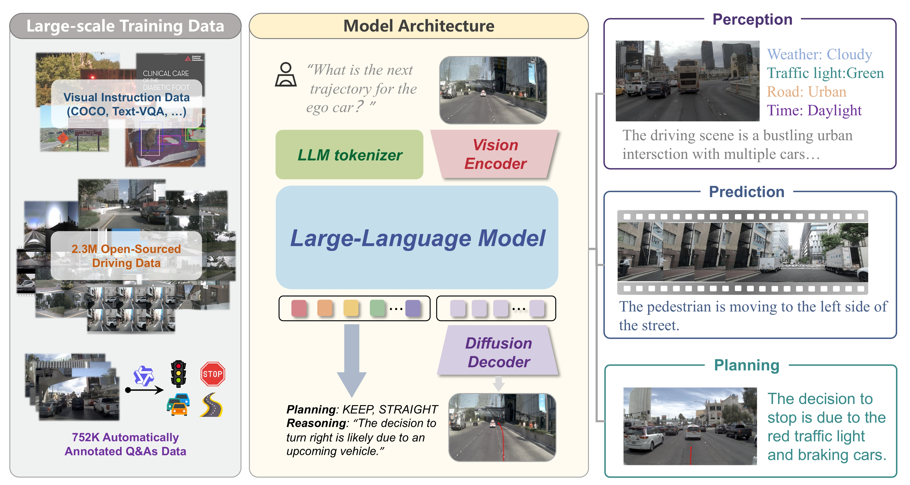

<div align="center">
<h3>ReCogDrive: A Reinforced Cognitive Framework for End-to-End Autonomous Driving</h3>

Yongkang Li<sup>1,2\*</sup>, Kaixin Xiong<sup>2\*</sup>, Xiangyu Guo<sup>1,2</sup>, Fang Li<sup>2</sup>, Sixu Yan<sup>1</sup>, Gangwei Xu<sup>1,2</sup>,  
Lijun Zhou<sup>2</sup>, Long Chen<sup>2</sup>, Haiyang Sun<sup>2†</sup>, Bing Wang<sup>2</sup>, Guang Chen<sup>2</sup>,  
Hangjun Ye<sup>2</sup>, Wenyu Liu<sup>1</sup>, Xinggang Wang<sup>1✉</sup>  

<sup>1</sup>Huazhong University of Science and Technology  
<sup>2</sup>Xiaomi EV  

(\*) Equal contribution. (†) Project leader. (✉) Corresponding author.  

<a href="https://arxiv.org/abs/2506.08052"></a>
<a href="https://xiaomi-research.github.io/recogdrive/"></a>
</div>


<!-- ## Introduction -->
## Abstract         

Although end-to-end autonomous driving has made remarkable progress, its performance degrades significantly in rare and long-tail scenarios. Recent approaches attempt to address this challenge by leveraging the rich world knowledge of Vision-Language Models (VLMs), but these methods suffer from several limitations: (1) a significant domain gap between the pre-training data of VLMs and real-world driving data, (2) a dimensionality mismatch between the discrete language space and the continuous action space, and (3) imitation learning tends to capture the average behavior present in the dataset, which may be suboptimal even dangerous. In this paper, we propose ReCogDrive, an autonomous driving system that integrates VLMs with diffusion planner, which adopts a three-stage paradigm for training. In the first stage, we use a large-scale driving question-answering datasets to train the VLMs, mitigating the domain discrepancy between generic content and real-world driving scenarios. In the second stage, we employ a diffusion-based planner to perform imitation learning, mapping representations from the latent language space to continuous driving actions. Finally, we fine-tune the diffusion planner using reinforcement learning with NAVSIM non-reactive simulator, enabling model to generate safer, more human-like driving trajectories. We evaluate our approach on the planning-oriented NAVSIM benchmark, achieving a PDMS of 89.6 and setting a new state-of-the-art that surpasses the previous vision-only SOTA by 5.6 PDMS.

## Overview
<div align="center">

</div>


## News
`[2025/06/11]` [ArXiv](https://arxiv.org/abs/2506.08052) paper release. Code/Models are coming soon. Please stay tuned! ☕️


## Updates
- [x] Release Paper  
- [ ] Release VLMs and Driving QA Datasets  
- [ ] Release Full Models and Inference Framework  
- [ ] Release Training Framework


## Citation
If you find ReCogDrive is useful in your research or applications, please consider giving us a star 🌟 and citing it by the following BibTeX entry.

```bibtex
@article{li2025recogdrive,
  title={ReCogDrive: A Reinforced Cognitive Framework for End-to-End Autonomous Driving},
  author={Li, Yongkang and Xiong, Kaixin and Guo, Xiangyu and Li, Fang and Yan, Sixu and Xu, Gangwei and Zhou, Lijun and Chen, Long and Sun, Haiyang and Wang, Bing and others},
  journal={arXiv preprint arXiv:2506.08052},
  year={2025}
}
```

